# Adidas Retail Insights: Análisis de Rendimiento Comercial y Rentabilidad
Este proyecto desarrolla un análisis del conjunto de datos transaccionales de Adidas con el propósito de convertir información de ventas en indicadores clave de rendimiento (KPIs). El objetivo principal es evaluar el desempeño comercial, analizar la rentabilidad operativa y detectar oportunidades de mejora en los distintos canales de distribución (In-store, Outlet y Online).

Mediante un enfoque analítico progresivo, se utilizan consultas en SQL Server, desde operaciones básicas de agregación hasta técnicas avanzadas como CTEs y Window Functions, para responder preguntas de negocio, identificar patrones relevantes en los datos y generar conclusiones orientadas a la toma de decisiones.

## Estructura del Proyecto

- [Sobre los Datos](#sobre-los-datos)
- [Objetivos del Análisis y Preguntas de Negocio](#objetivos-del-análisis-y-preguntas-de-negocio)
- [Limpieza de Datos (Data Cleaning & ETL)](#limpieza-de-datos-data-cleaning--etl)
- [Análisis Exploratorio de Datos e Insights](#análisis-exploratorio-de-datos-e-insights)

## Sobre los Datos
El acceso al repositorio de datos original y sus especificaciones se encuentra en este [enlace](https://www.kaggle.com/datasets/heemalichaudhari/adidas-sales-dataset/data).

La fuente de información consta de un archivo plano con 13 columnas y una volumetría superior a los 9,600 registros analíticos de rendimiento de ventas. Para garantizar un entorno escalable y de alto rendimiento en las consultas, importamos esta información en una base de datos relacional hospedada en SQL Server. Este esquema nos permite descomponer y evaluar de manera ágil las métricas clave de la marca cruzando factores logísticos, líneas de calzado/indumentaria y métodos de comercialización.

El resultado de la ingesta de datos y el tipado estructurado se puede corroborar en la siguiente vista previa del sistema:

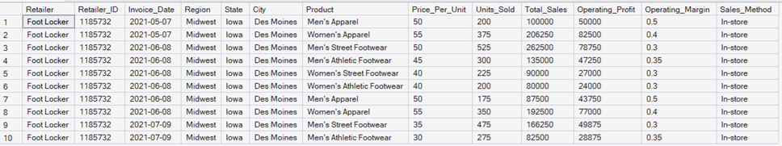


## Objetivos del Análisis y Preguntas de Negocio

En este análisis se busca responder las siguientes preguntas de negocio relacionadas con el desempeño comercial y financiero de Adidas:

1. **Rendimiento Global:** ¿Cuál es el total de ingresos por ventas y el beneficio operativo histórico generado por la marca?
2. **Líneas de Producto:** ¿Cuáles son las categorías de producto que acumulan el mayor volumen de unidades vendidas?
3. **Rentabilidad por Canal:** ¿Cómo se compara el margen operativo promedio entre los diferentes métodos de venta (Online, In-store, Outlet)?
4. **Dominio Geográfico:** ¿Qué regiones y estados de la federación concentran más del 60% de los ingresos totales de la compañía?
5. **Desempeño de Distribuidores:** Clasificar a los principales minoristas (*Retailers*) según el total de ventas y beneficio generado.
6. **Estacionalidad y Tiempo:** ¿Existe una tendencia de crecimiento en las ventas al comparar el comportamiento trimestral o mensual de los datos?
7. **Talento Top en Ventas:** Identificar las 3 ciudades con el mayor pico de facturación para cada una de las regiones analizadas.
8. **Eficiencia Comercial:** Categorizar las transacciones según el volumen de ventas e identificar el promedio de margen operativo en cada categoría.
9. **Precios vs. Demanda:** ¿Existe una relación directa entre el precio por unidad establecido y el volumen total de unidades vendidas por producto?
10. **Alerta de Rentabilidad:** Identificar qué combinaciones de producto y ciudad operan con un margen de ganancia crítico (inferior al promedio global).

## Limpieza de Datos (Data Cleaning & ETL)

Para garantizar la integridad de la información y la eficiencia en el procesamiento, se implementó una arquitectura de carga de datos tipo **ETL (Extracción, Transformación y Carga)**. Debido a que el archivo de origen `.csv` contenía formatos de texto plano con caracteres especiales de hojas de cálculo, el proceso de sanitización se integró directamente en el flujo de inserción.

### 1. Estrategia de Ingesta y Transformación (SQL)
La limpieza de las variables se ejecutó en el paso de transferencia desde la tabla temporal (`#AdidasStaging`) hacia la tabla definitiva (`AdidasSales`), aplicando las siguientes reglas técnicas:

* **Desinfección Monetaria:** Se anidaron funciones REPLACE para eliminar los símbolos de moneda (`$`) y los separadores de miles (`,`) en las columnas Price_Per_Unit, Total_Sales y Operating_Profit, aplicando posteriormente un TRY_CAST a tipo `FLOAT` para habilitar las operaciones matemáticas.
* **Normalización del Margen Operativo:** La variable `Operating_Margin` fue despojada del símbolo `%` y dividida entre `100.0` para transformarla a una escala decimal base 1 (ej. `40%` pasó a ser `0.40`), previniendo sesgos en los cálculos de ratios financieros.
* **Consistencia Temporal y de Cantidades:** Se removieron comas en `Units_Sold` para forzar su conversión a entero (`INT`) y se procesó `Invoice_Date` hacia el tipo de dato estándar `DATE`.

El bloque de código principal que consolidó esta limpieza y transformación se detalla a continuación:

```sql
-- Transferencia sanitizada desde el área de Staging a la Tabla Definitiva
INSERT INTO AdidasSales (
    Retailer, Retailer_ID, Invoice_Date, Region, State, City, 
    Product, Price_Per_Unit, Units_Sold, Total_Sales, Operating_Profit, Operating_Margin, Sales_Method
)
SELECT 
    Retailer,
    TRY_CAST(Retailer_ID AS INT),
    TRY_CAST(Invoice_Date AS DATE),
    Region, State, City, Product,
    TRY_CAST(REPLACE(REPLACE(Price_Per_Unit, '$', ''), ',', '') AS FLOAT),
    TRY_CAST(REPLACE(Units_Sold, ',', '') AS INT),
    TRY_CAST(REPLACE(REPLACE(Total_Sales, '$', ''), ',', '') AS FLOAT),
    TRY_CAST(REPLACE(REPLACE(Operating_Profit, '$', ''), ',', '') AS FLOAT),
    TRY_CAST(REPLACE(Operating_Margin, '%', '') AS FLOAT) / 100.0,
    Sales_Method
FROM #AdidasStaging;
```
## Análisis Exploratorio de Datos e Insights
En esta sección se presentan las consultas SQL desarrolladas para analizar las principales preguntas de negocio relacionadas con el desempeño comercial y financiero de Adidas. El análisis se organiza mediante un enfoque progresivo, incorporando desde consultas fundamentales hasta técnicas más avanzadas de SQL para demostrar la evolución de la solución analítica.

Cada consulta está enfocada en traducir los datos limpios en métricas de negocio, abarcando desde agregaciones tradicionales hasta el uso de funciones de ventana (*Window Functions*), expresiones de tabla comunes (`CTEs`) y subconsultas complejas.

### 1. Rendimiento Global: ¿Cuál es el total de ingresos por ventas y el beneficio operativo histórico generado por la marca?

```sql
SELECT 
    FORMAT(SUM(Total_Sales), 'C0') AS Ingresos_Totales_Historicos,
    FORMAT(SUM(Operating_Profit), 'C0') AS Beneficio_Operativo_Total
FROM AdidasSales;
```
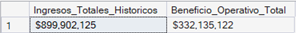

**Insight:** Adidas registra una sólida escala comercial con $899.9M en ingresos históricos y una destacada eficiencia operativa, logrando capitalizar $332.1M como beneficio neto. Esto representa un margen operativo global del 36.9%, un indicador altamente saludable en el sector retail que confirma un control óptimo de los costos de producción y distribución.

### 2. Líneas de Producto: ¿Cuáles son las categorías de producto que acumulan el mayor volumen de unidades vendidas?

```sql
SELECT 
    Product, 
    SUM(Units_Sold) AS Total_Unidades_Vendidas
FROM AdidasSales
WHERE Units_Sold IS NOT NULL
GROUP BY Product
ORDER BY Total_Unidades_Vendidas DESC;
```
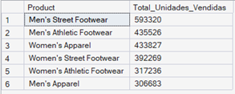

**Insight:** Los artículos que lideran el volumen físico representan el motor de rotación de la compañía. Monitorear esta métrica es clave para coordinar con los centros de distribución, evitar quiebres de stock en los modelos más populares y garantizar que el cliente siempre encuentre lo que busca.

### 3. Rentabilidad por Canal: ¿Cómo se compara el margen operativo promedio entre los diferentes métodos de venta (Online, In-store, Outlet)?

```sql
SELECT 
    Sales_Method, 
    FORMAT(AVG(Operating_Margin), 'P2') AS Margen_Operativo_Promedio
FROM AdidasSales
WHERE Operating_Margin IS NOT NULL
GROUP BY Sales_Method
ORDER BY AVG(Operating_Margin) DESC;
```
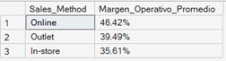

**Insight:** El canal Online es el método más rentable para la compañía debido a sus bajos costos fijos de operación en comparación con las tiendas físicas. Esto demuestra que la estrategia de crecimiento de Adidas debe seguir priorizando la digitalización y el comercio electrónico. 

### 4. Dominio Geográfico: ¿Qué regiones y estados concentran la mayor participación de ingresos de la compañía?

```sql
SELECT TOP 5 
    Region, 
    State, 
    SUM(Total_Sales) AS Ventas_Totales,
    FORMAT(SUM(Total_Sales) / (SELECT SUM(Total_Sales) FROM AdidasSales WHERE Total_Sales IS NOT NULL), 'P2') AS Porcentaje_Participacion
FROM AdidasSales
WHERE Total_Sales IS NOT NULL
GROUP BY Region, State
ORDER BY SUM(Total_Sales) DESC;
```
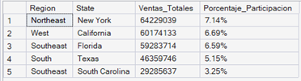

**Insight:** El análisis permite identificar los estados y regiones con mayor contribución al ingreso total de Adidas, evidenciando la concentración geográfica del rendimiento comercial. Estos resultados ayudan a comprender qué mercados generan mayor valor y pueden servir como referencia para orientar estrategias de distribución, marketing y planificación comercial.

### 5. Desempeño de Distribuidores: Clasificar a los principales minoristas (Retailers) según el total de ventas y beneficio generado.

```sql
SELECT 
    Retailer, 
    SUM(Total_Sales) AS Ventas_Totales,
    SUM(Operating_Profit) AS Beneficio_Total
FROM AdidasSales
WHERE Total_Sales IS NOT NULL AND Operating_Profit IS NOT NULL
GROUP BY Retailer
ORDER BY Ventas_Totales DESC;
```
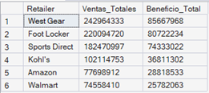

**Insight:** La evaluación del desempeño de los retailers permite identificar cuáles distribuidores generan mayor contribución en ventas y beneficio para Adidas. Esta información facilita el análisis de los socios comerciales más relevantes y su impacto en los resultados del negocio.

### 6. Estacionalidad y Tiempo: ¿Existe una tendencia de crecimiento en las ventas al comparar el comportamiento mensual de los datos?

```sql
SELECT 
    YEAR(Invoice_Date) AS Anio,
    MONTH(Invoice_Date) AS Mes,
    SUM(Total_Sales) AS Ventas_Totales
FROM AdidasSales
WHERE Invoice_Date IS NOT NULL AND Total_Sales IS NOT NULL
GROUP BY YEAR(Invoice_Date), MONTH(Invoice_Date)
ORDER BY Anio ASC, Mes ASC;
```
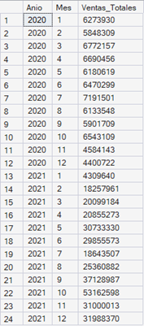

**Insight:** El desglose temporal permite identificar picos de venta estacionales (asociados habitualmente a festividades, cambios de temporada o campañas de regreso a clases) y evaluar la tendencia general del negocio. Detectar estos patrones es fundamental para planificar el flujo de caja, anticipar las necesidades de contratación de personal temporal y programar las campañas de marketing antes de que inicien los meses de mayor demanda.

### 7. Principales Ciudades por Ventas: Identificar las ciudades con mayor contribución de ingresos dentro de cada región analizada.
```sql
WITH RankingCiudades AS (
    SELECT 
        Region, 
        City, 
        SUM(Total_Sales) AS Ventas_Totales,
        DENSE_RANK() OVER (PARTITION BY Region ORDER BY SUM(Total_Sales) DESC) AS Posicion
    FROM AdidasSales
    WHERE Region IS NOT NULL AND City IS NOT NULL AND Total_Sales IS NOT NULL
    GROUP BY Region, City
)
SELECT 
    Region, 
    City, 
    Ventas_Totales
FROM RankingCiudades
WHERE Posicion <= 3
ORDER BY Region ASC, Ventas_Totales DESC;
```
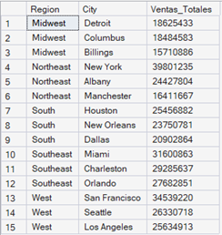

**Insight:** Los resultados obtenidos permiten identificar las ciudades con mayor contribución de ingresos dentro de cada región, destacando los mercados con mejor desempeño comercial. Esta información facilita la evaluación del rendimiento geográfico y el reconocimiento de las zonas con mayor impacto en las ventas de la compañía.

### 8. Eficiencia Comercial: Categorizar las transacciones según el volumen de ventas e identificar el promedio de margen operativo en cada categoría.

```sql
SELECT 
    CASE 
        WHEN Total_Sales >= 500000 THEN 'Venta Alta (>= 500K)'
        WHEN Total_Sales BETWEEN 150000 AND 499999 THEN 'Venta Media (150K - 500K)'
        ELSE 'Venta Baja (< 150K)'
    END AS Categoria_Venta,
    COUNT(*) AS Total_Transacciones,
    FORMAT(AVG(Operating_Margin), 'P2') AS Promedio_Margen_Operativo
FROM AdidasSales
WHERE Total_Sales IS NOT NULL AND Operating_Margin IS NOT NULL
GROUP BY 
    CASE 
        WHEN Total_Sales >= 500000 THEN 'Venta Alta (>= 500K)'
        WHEN Total_Sales BETWEEN 150000 AND 499999 THEN 'Venta Media (150K - 500K)'
        ELSE 'Venta Baja (< 150K)'
    END
ORDER BY MIN(Total_Sales) DESC;
```
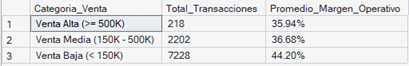

**Insight:** La segmentación de las transacciones por volumen de ventas permite analizar las diferencias en el margen operativo promedio entre cada categoría. Estos resultados ayudan a comprender la eficiencia comercial según el tamaño de las operaciones realizadas.

### 9. Precios vs. Demanda: ¿Existe una relación directa entre el precio por unidad establecido y el volumen total de unidades vendidas por producto?
```sql
SELECT 
    Product,
    AVG(Price_Per_Unit) AS Precio_Promedio_Unitario,
    SUM(Units_Sold) AS Total_Unidades_Vendidas
FROM AdidasSales
WHERE Product IS NOT NULL 
  AND Price_Per_Unit IS NOT NULL
GROUP BY Product
ORDER BY Precio_Promedio_Unitario DESC;
```
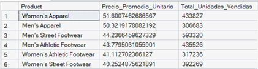

**Insight:** La comparación entre el precio promedio por unidad y el volumen total de unidades vendidas permite identificar patrones en el comportamiento de la demanda según el posicionamiento de precios de cada producto. Estos resultados pueden apoyar la evaluación de estrategias comerciales y la gestión del portafolio de productos.

### 10. Alerta de Rentabilidad: Identificar qué combinaciones de producto y ciudad operan con un margen de ganancia crítico (inferior al promedio global).

```sql
SELECT TOP 5
    City AS Ciudad,
    Product AS Producto,
    AVG(Operating_Margin) AS Margen_Promedio_Local
FROM AdidasSales
WHERE Product IS NOT NULL 
  AND City IS NOT NULL
GROUP BY City, Product
HAVING AVG(Operating_Margin) < (SELECT AVG(Operating_Margin) FROM AdidasSales)    
ORDER BY Margen_Promedio_Local ASC;
```
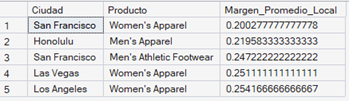

**Insight:** Esta consulta detecta las zonas geográficas y líneas de productos cuyo rendimiento financiero está mermando la rentabilidad general de la compañía. Al filtrar los casos que se sitúan por debajo del promedio global, el equipo de Operaciones puede enfocar sus recursos en auditar costos logísticos locales o reestructurar las estrategias de precios en esos puntos específicos para recuperar los márgenes óptimos.

## Conclusiones

El presente proyecto permitió analizar el desempeño comercial de Adidas mediante un flujo completo de trabajo en SQL Server, abarcando la preparación, transformación y análisis de datos.

A partir de las consultas desarrolladas, se obtuvieron indicadores relevantes sobre ventas, rentabilidad, comportamiento por canal de distribución, desempeño geográfico y participación de productos y retailers. Estos análisis permitieron identificar patrones de comportamiento y generar una visión más clara sobre la distribución de ingresos y márgenes dentro del conjunto de datos evaluado.

Desde el punto de vista técnico, el proyecto fortaleció la aplicación de herramientas fundamentales de análisis de datos, incluyendo limpieza de información, consultas agregadas, agrupaciones, CTEs y funciones de ventana.

Los resultados obtenidos demuestran cómo un proceso estructurado de análisis con SQL puede transformar datos transaccionales en información útil para evaluar tendencias, comparar indicadores y apoyar procesos de toma de decisiones basados en datos.


